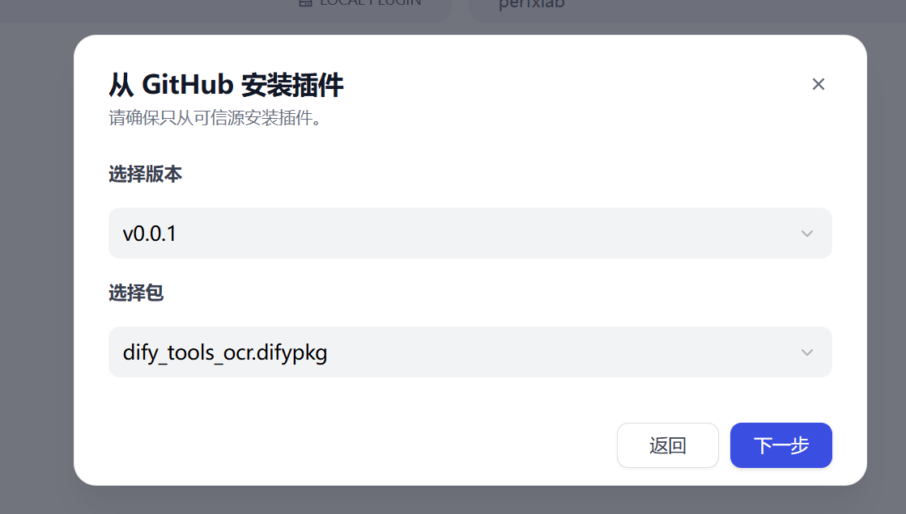
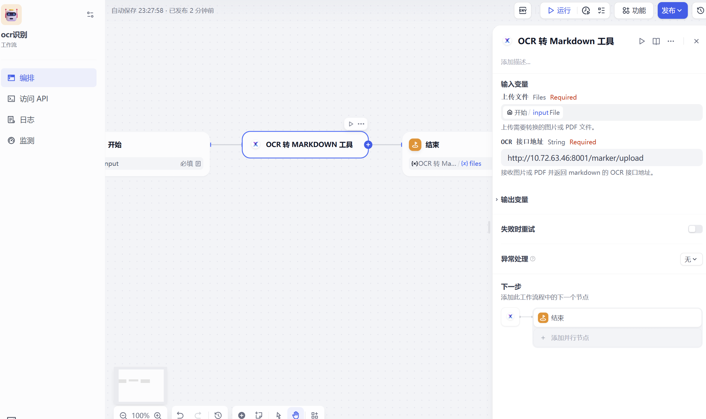

# OCR识别服务

## 描述
一种专为OCR识别服务提供的dify插件工具，增强dify聊天流和工作流对PDF、图片等文件的处理和理解能力。

## 使用

### 1. 支持OCR服务HTTP
目前支持部分http请求接口，后续会对更多OCR服务接口进行适配

现已支持接口：
| Request Method | Request Body |
| ----------- | ----------- |
| POST        | file * (required) string($binary)  |
|             | force_ocr (option) boolean         |
|             | paginate_output (option) boolean   |
|             | output_format (option) string      |

### 2. 安装Dify OCR服务插件

插件->安装插件->GitHub

填写git仓库地址：https://github.com/PerfXLab/dify-plugin-ocr-service

选择相应版本

### 3. 工作流调用
